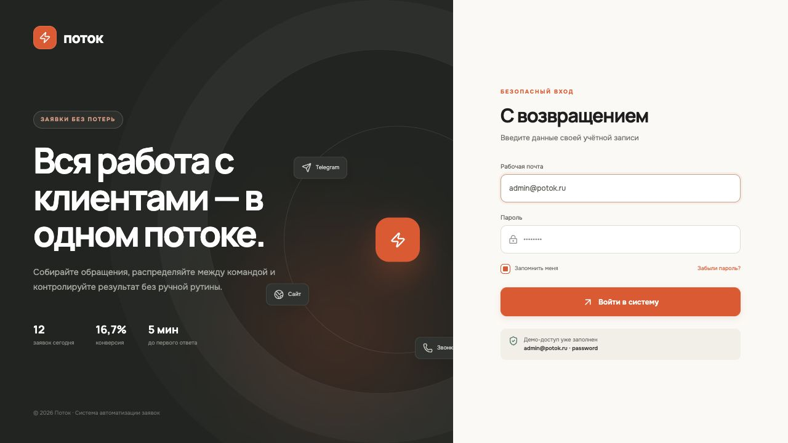
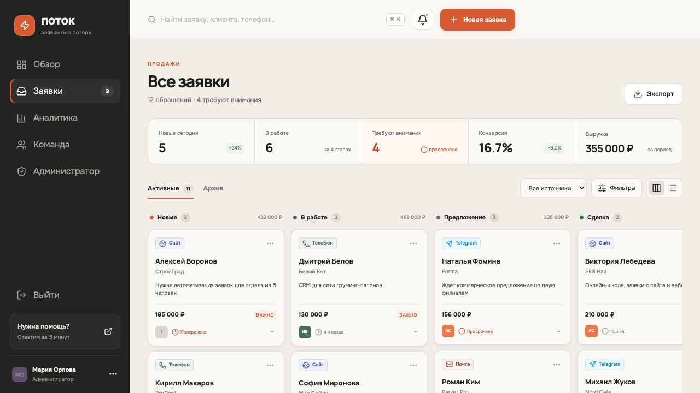
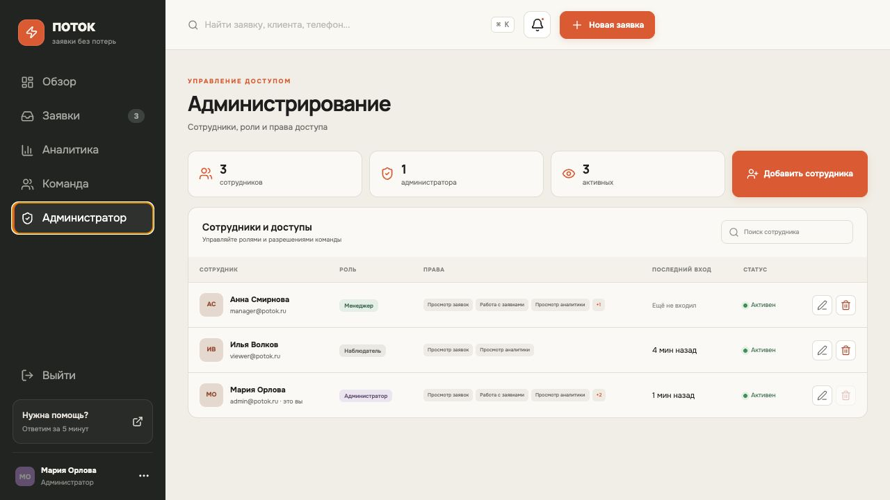

# Поток — система автоматизации заявок

**Поток** — демонстрационная CRM-система для малого бизнеса, которая объединяет обращения с сайта, Telegram, телефона, электронной почты и партнёрских каналов.

Система помогает распределять заявки между сотрудниками, контролировать этапы продаж, отслеживать просроченные обращения, анализировать эффективность каналов и управлять доступом команды.

## Интерфейс

### Авторизация

Отдельная адаптивная страница входа с Laravel-сессией. Заблокированные пользователи не могут войти в систему, а все рабочие API-маршруты требуют авторизации.



### Воронка заявок

Главный рабочий экран показывает обращения по этапам:

- новые;
- в работе;
- предложение;
- сделка;
- отказ.

В верхней части отображаются ключевые показатели: количество новых заявок, обращения в работе, просрочки, конверсия и выручка.



Карточка заявки содержит:

- имя клиента и компанию;
- источник обращения;
- контактные данные;
- бюджет;
- приоритет;
- ответственного сотрудника;
- дату следующего контакта;
- комментарии;
- полную историю изменений.

Статус можно менять непосредственно из канбана или подробной карточки.

### Администрирование

Администратор управляет сотрудниками, ролями и отдельными разрешениями.



Доступные операции:

- создание сотрудника;
- изменение имени, почты и пароля;
- назначение роли;
- включение и блокировка учётной записи;
- настройка отдельных разрешений;
- удаление пользователя;
- просмотр последнего входа.

Система не позволяет администратору удалить собственную учётную запись, заблокировать себя или снять с себя роль администратора.

## Функциональность

- несколько источников заявок;
- канбан-воронка продаж;
- табличный режим;
- ответственные сотрудники;
- приоритеты и бюджеты;
- комментарии и история изменений;
- напоминания о следующем контакте;
- выделение просроченных обращений;
- поиск и фильтрация;
- экспорт заявок в Excel-совместимый CSV;
- аналитика по каналам;
- показатели менеджеров;
- адаптивный интерфейс;
- сессионная авторизация;
- роли и granular-права доступа;
- управление пользователями.

## Роли и права

В проекте предусмотрены три базовые роли.

| Роль | Назначение |
|---|---|
| Администратор | Полный доступ к заявкам, аналитике, экспорту и сотрудникам |
| Менеджер | Обработка заявок, комментарии, аналитика и экспорт |
| Наблюдатель | Просмотр заявок и аналитики без возможности изменения |

Администратор может отдельно включать или отключать следующие разрешения:

| Разрешение | Возможности |
|---|---|
| `view_leads` | Просмотр заявок, клиентов и истории |
| `manage_leads` | Создание и изменение заявок, комментарии |
| `view_analytics` | Просмотр аналитики |
| `export_data` | Выгрузка заявок в CSV |
| `manage_users` | Управление сотрудниками и правами |

Ограничения проверяются на сервере. Скрытие кнопки в интерфейсе не является единственным уровнем защиты: Laravel возвращает `401` для неавторизованных запросов и `403` при отсутствии необходимого разрешения.

## Технологии

### Backend

- PHP 8.3+;
- Laravel 13;
- Eloquent ORM;
- SQLite;
- Laravel Session Authentication;
- PHPUnit.

### Frontend

- React 19;
- Vite 8;
- Tailwind CSS 4;
- Recharts;
- Lucide React;
- адаптивная CSS-вёрстка.

## Структура проекта

```text
app/
├── Http/Controllers/
│   ├── AuthController.php
│   ├── AdminUserController.php
│   └── LeadController.php
└── Models/
    ├── Lead.php
    ├── LeadActivity.php
    └── User.php

database/
├── migrations/
└── seeders/DatabaseSeeder.php

resources/
├── css/app.css
├── js/app.jsx
└── views/app.blade.php

routes/
├── api.php
└── web.php
```

## Локальный запуск

### Требования

- PHP 8.3 или новее;
- Composer 2;
- Node.js 20 или новее;
- npm.

### Установка

```bash
git clone git@github.com:zzsxd/PotokSystem.git
cd PotokSystem

composer install
npm install

cp .env.example .env
php artisan key:generate

touch database/database.sqlite
php artisan migrate --seed

npm run build
php artisan serve
```

После запуска приложение будет доступно по адресу:

```text
http://127.0.0.1:8000
```

Для разработки с автоматическим обновлением клиентской части:

```bash
npm run dev
```

Laravel-сервер запускается отдельно:

```bash
php artisan serve
```

## Демо-пользователи

После выполнения `php artisan migrate --seed` создаются следующие записи:

| Роль | Email | Пароль |
|---|---|---|
| Администратор | `admin@potok.ru` | `password` |
| Менеджер | `manager@potok.ru` | `password` |
| Наблюдатель | `viewer@potok.ru` | `password` |

Демо-пароли предназначены только для локального запуска. Перед публикацией системы необходимо заменить их и настроить безопасные значения окружения.

## API

Все маршруты, кроме входа, требуют активной пользовательской сессии.

### Авторизация

| Метод | Маршрут | Назначение |
|---|---|---|
| `POST` | `/api/auth/login` | Вход |
| `GET` | `/api/auth/me` | Текущий пользователь |
| `POST` | `/api/auth/logout` | Выход |

### Заявки

| Метод | Маршрут | Назначение |
|---|---|---|
| `GET` | `/api/dashboard` | Заявки, показатели, источники и команда |
| `POST` | `/api/leads` | Создать заявку |
| `PATCH` | `/api/leads/{lead}` | Изменить заявку |
| `POST` | `/api/leads/{lead}/comments` | Добавить комментарий |
| `GET` | `/api/export` | Экспортировать заявки |

### Администрирование

| Метод | Маршрут | Назначение |
|---|---|---|
| `GET` | `/api/admin/users` | Получить сотрудников и список разрешений |
| `POST` | `/api/admin/users` | Создать сотрудника |
| `PATCH` | `/api/admin/users/{user}` | Изменить сотрудника |
| `DELETE` | `/api/admin/users/{user}` | Удалить сотрудника |

## Проверка проекта

Запуск PHP-тестов:

```bash
php artisan test
```

Проверка форматирования PHP:

```bash
vendor/bin/pint --test
```

Production-сборка frontend:

```bash
npm run build
```

## Возможные направления развития

- приём заявок через Telegram Bot API;
- публичная форма сайта;
- интеграция с amoCRM или Bitrix24;
- синхронизация с Google Sheets;
- email- и Telegram-уведомления;
- фоновые напоминания через Laravel Queue;
- аудит входов и административных действий;
- двухфакторная авторизация;
- восстановление пароля;
- несколько организаций в одной установке.

## Лицензия

Проект распространяется под лицензией MIT.
